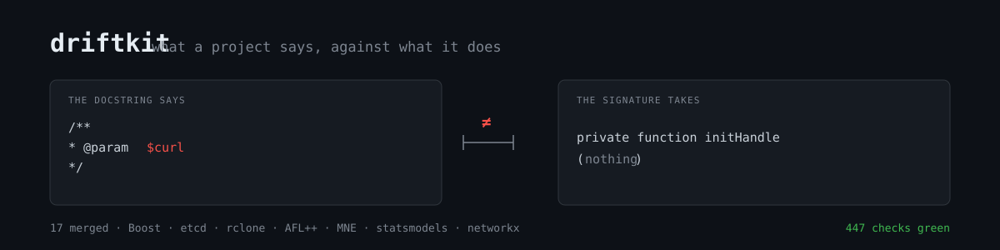

<p align="center">
  
</p>

<p align="center">
  <strong>Sixteen tools that compare what a project <em>says</em> against what it <em>does</em>.</strong><br>
  Python 3.9+, standard library only, nothing to install.<br>
  <sub>by <a href="https://github.com/karpovantonme">Anton Karpov</a> · <a href="https://karpovanton.com">karpovanton.com</a></sub>
</p>

<p align="center">
  <a href="#tests"></a>
  <a href="FALSE-POSITIVES.md"></a>
  <a href="#findings-that-became-merged-pull-requests"></a>
  <a href="LICENSE"></a>
</p>

---

Every check here has the same shape: two statements about the same thing, in two places, and nobody compares them.

A docstring against the signature below it. A CI matrix against the versions the package claims to support. A vendored copy against the upstream that has since been fixed. A translated page against the original. A link in the docs against the server that used to answer it.

Linters do not find these, because a linter reads the code. Here you have to read the code **and the thing next to it**.

```console
$ python3 driftkit/docdrift.py ~/src/statsmodels

=== Documented name not in the signature (16) ===

  ~/src/statsmodels/archive/descstats.py:20  descstats()
    docstring:  v
    code:       data, cols, axis
  ...

=== Coverage ===
  tree:                   ~/src/statsmodels
  files read:             522
  functions with Parameters: 2339
  properties skipped:     293 (docstring describes what they return)
  findings:               16 hard, 3 soft
  run:                    docdrift.py fingerprint 17f92143
```

A real run, not an illustration. Eleven of those sixteen sit in `archive/`, which is why every report prints **where it looked** rather than a verdict.

## The tools

Eleven detectors. Each one is a species of defect we hit on a live project, not a category invented at a desk.

| Tool | What it compares |
|---|---|
| `docdrift` | numpydoc `Parameters` against the real Python signature |
| `doxdrift` | Doxygen `\param` and `\tparam` against the real C++ declaration |
| `ifacedrift` | protobuf against OpenAPI, when a project maintains both by hand |
| `liftdrift` | a vendored copy against the upstream commit that fixed it |
| `transdrift` | a translated page against the original it was translated from |
| `supportdrift` | declared version support against the CI matrix that runs |
| `gitdrift` | a struct field that was added, and the walker that was not updated |
| `namedrift` | one name spelled two ways across docs and code |
| `deaddrift` | removed in the changelog, still promised in the docs |
| `assertdrift` | a helm-unittest assertion that never compares its message |
| `linkdrift` | external links that no longer answer |

Five pipeline stages around them.

| Stage | What it does |
|---|---|
| `sweep` | one run over a project instead of eleven by hand: survey, plan, run, refute |
| `sitecheck` | reads the project's own rules and says whether it is worth going there |
| `refute` | tries to kill each finding before you ever see it |
| `probe` | proves a test fails when it should, by swapping the expected value |
| `buildprobe` | says whether behaviour can be checked on this project at all |

```console
$ python3 driftkit/sweep.py --dir ~/src/some-project
```

The plan is always printed, including the checks that do **not** apply:

```
  [yes] supportdrift   metadata pyproject.toml, package.json and a CI matrix
  [yes] docdrift       487 Python files
  [yes] linkdrift      234 text files with links (needs the network for proof)
  [no ] deaddrift      no changelog, so there is nowhere to take removed names from
  [no ] liftdrift      not a Go project, the lifted-code parser reads Go only
  [no ] assertdrift    no helm-unittest suites
```

A check that does not apply never silently disappears. It stands in the report with a reason.

## Where it lies

This section is here on purpose, and it is the part worth reading.

A tool like this is worth exactly the list of mistakes already worked out of it, and that list **is** the product. Accuracy here is not a property of an algorithm, it is accumulated reading.

| What was reported as a defect | Cost when found | What removed it |
|---|---|---|
| An invented "reverse form" of a removal pattern | **14,022 false findings** | The rule was deleted entirely |
| A translated comment inside a code example | **166 of 170** | Strip full-line and trailing comments |
| `@property`: the docstring describes the view it returns | **41 of 44** on networkx | Properties are not judged |
| `@deprecate_kwarg` still accepts the old name | **30 of 56** on statsmodels | Names a decorator spells out join the signature |
| `default 0.01` truncated at the dot to `0` | **102** across five projects | Value ends at a sentence boundary |
| Sentinel `None` against what it becomes | **80 of 168** on networkx | Sentinels are not compared |
| A name insertion counted as a typo | **162** | Transposition and substitution only |
| An AI section in CONTRIBUTING taken for a ban | **would have skipped rclone, where we have a merge** | Judge by the requirements, not the heading |

Sixty-six worked cases, twelve species of mistake, and the table of what the kit is **not** immunised against yet: **[FALSE-POSITIVES.md](FALSE-POSITIVES.md)**.

Two of those entries are worth singling out, because they are the dangerous kind: a self-refutation step that quietly killed real findings, and a directory mask that dropped `.github` and so reduced coverage without saying so. Both made the report look *cleaner*. That is why every run ends with a coverage block: `findings: 0 hard` next to `files read: 0` means "nothing to compare", not "clean".

**If it lies to you, open an issue with the case.** A file, a line, what it said, what is actually there. Every row above arrived that way.

## Where it stays quiet

A tool that never reports zero has not been calibrated.

- **etcd, 0 findings.** Correct: their swagger is generated from proto, the two cannot disagree by construction.
- **Boost.Histogram, 0 after a parser fix.** All 11 earlier findings were `decltype(auto)` misread as an argument list.
- **AFL++, 0.** The one real mismatch was fixed by [a pull request from this kit](https://github.com/AFLplusplus/AFLplusplus/pull/2865).

## Findings that became merged pull requests

Not examples written for a README.

| Project | What it found | Merged |
|---|---|---|
| [Boost.Algorithm](https://github.com/boostorg/algorithm/pull/131) | `is_permutation` documents `last2`, a local variable inside the body | 15 h, by the library author |
| [Boost.GIL](https://github.com/boostorg/gil/pull/792) · [again](https://github.com/boostorg/gil/pull/793) | 22 `\param` names against the declarations | 18 h, then 1 h |
| [rclone](https://github.com/rclone/rclone/pull/9721) | docs referencing a flag removed two releases ago | 20 h, by the founder |
| [etcd](https://github.com/etcd-io/etcd/pull/22244) | sample config offering six settings cut in 3.6 | 12 h |
| [MNE-Python](https://github.com/mne-tools/mne-python/pull/14125) | a docstring describing a parameter that does not exist | 11 h |
| [statsmodels](https://github.com/statsmodels/statsmodels/pull/10028) | five parameters documented but not accepted | under an hour |
| [toqito](https://github.com/vprusso/toqito/pull/1910) | a test named for one property, catching another | 9 h |
| [sniffnet](https://github.com/GyulyVGC/sniffnet/pull/1266) | notifications posting JSON without `Content-Type` | 17 h |

Fifty-eight sent, seventeen merged, median time to merge fifteen hours.

## If you are running this with an agent

The kit plus an agent can open twenty pull requests in an afternoon, and twenty pull requests in an afternoon is what gets all of them closed unread. That happened to us: two people ran the same checker against the same project a day apart, both patches were correct, and the maintainer closed both.

Read **[USING-THIS-WITH-AN-AGENT.md](USING-THIS-WITH-AN-AGENT.md)** first. Short version: say a tool found it, read the project's own rules before writing anything, never send a finding you have not opened in an editor, and check **[TERRITORY.md](TERRITORY.md)** so you do not land where someone already is. Add yourself there while you are at it.

## Install

There is nothing to install.

```console
git clone https://github.com/karpovantonme/driftkit
python3 driftkit/driftkit/docdrift.py ~/src/your-project
```

One optional dependency: `ifacedrift` needs `protobuf` to parse `.proto` files (`pip install protobuf`). Everything else is the standard library.

## Tests

```console
$ cd driftkit && for f in test_*.py; do python3 "$f"; done
451 checks, 0 failures
```

Most of them pin a false positive that used to happen. `test_conformance.py` is the odd one out: it checks the tools against **each other**, and it is the only test that catches a tool drifting away from the shared contract. Run it after any change.

## Contract

Every tool takes `--json FILE` and `-v`, writes objects carrying a boolean `hard`, ends with a `=== Coverage ===` block, and **exits 1 if and only if there is at least one hard finding** — so it drops straight into a shell `if`. See [`driftkit/common.py`](driftkit/common.py).

## License

MIT. See [LICENSE](LICENSE).

---

<p align="center">
  <sub>Built by <a href="https://github.com/karpovantonme">Anton Karpov</a> — <a href="https://karpovanton.com">karpovanton.com</a><br>
  Out of reading the places where it lied, on live projects, one case at a time.</sub>
</p>
